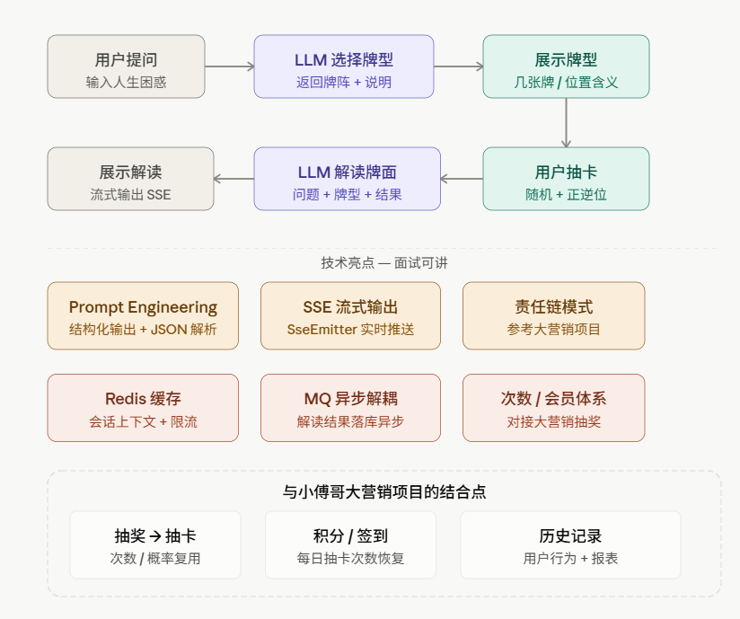

先看整体架构和用户流程：

项目定位建议
项目名：AI 塔罗（暂定），目标是"将 AI 能力融入传统塔罗牌场景的 LLM 应用实践，让LLM扮演占卜师"。

这两个项目在简历上的分工要明确：

塔罗 AI 项目：展示你的 LLM 接入能力 + Prompt 工程 — 这是差异化卖点
大营销项目：展示你的 分布式 + 高并发 + 设计模式 基本功
技术栈和核心技术点
LLM 推荐选通义千问（阿里云百炼平台）。理由：免费额度够用、响应稳定、支持 Function Calling 和流式输出，国内访问无需代理，开发体验好。接口格式和 OpenAI 兼容，换模型成本极低。

核心技术点（面试重点）：

第一，Prompt Engineering。项目里有两次 LLM 调用，各需要精心设计 prompt。第一次让 LLM 返回结构化 JSON（牌型名、张数、每个位置的含义），你需要在 prompt 里约束输出格式，然后用 Jackson 解析。第二次传入"用户问题 + 牌型说明 + 具体抽到的牌"，让 LLM 做综合解读。这两个 prompt 的设计和迭代过程本身就是很好的话题。

第二，SSE 流式输出。解读结果不要等 LLM 全部返回再展示，用 Spring 的 SseEmitter 实现逐字流式推送，用户体验从"等待 5 秒"变成"打字机效果实时呈现"。这个技术点几乎每家面试都会问到。

第三，责任链模式做 LLM 调用链。参考大营销的设计，把"参数校验 → 次数扣减 → Prompt 拼接 → LLM 调用 → 结果解析 → 异步落库"做成责任链，每个节点职责单一，方便扩展和测试。

第四，Redis 的使用。至少两个场景：会话上下文缓存（把用户的问题和牌型临时存 Redis，给第二次 LLM 调用用）、接口限流（防止用户刷接口消耗 token）。

第五，与大营销的结合点。把"每日抽卡次数"对接到大营销的积分/签到体系，用户签到可以恢复次数，这样两个项目就产生了真实的业务联系，而不是简历上两个孤立项目。

工程结构建议
tarot-ai/
├── tarot-api/          # Spring Boot 主服务
│   ├── interfaces/     # Controller 层（HTTP + SSE）
│   ├── application/    # 应用服务 / 责任链编排
│   ├── domain/         # 核心领域：牌型、解读、用户次数
│   └── infrastructure/ # LLM 客户端、Redis、MQ、DB
├── tarot-types/        # 跨模块 DTO / 枚举
└── tarot-ui/           # 前端（Vue 或 React 均可，简单一页搞定）
用 DDD 分层，哪怕项目不大，这个结构本身就能体现你对大营销项目的学习成果。

面试话术示例
当面试官问"讲讲你的个人项目"时，可以这样开场：

"我做了一个 AI 塔罗牌应用，核心想解决的问题是：怎么把 LLM 的能力集成到一个有具体业务场景的 Web 应用里，而不只是简单的对话框。项目里有两个技术重点，一个是 Prompt 工程，需要让 LLM 按照我规定的 JSON 格式返回结构化数据；另一个是 SSE 流式推送，解读结果实时呈现而不是等待。整体架构参考了小傅哥大营销项目的 DDD 分层和责任链模式……"
